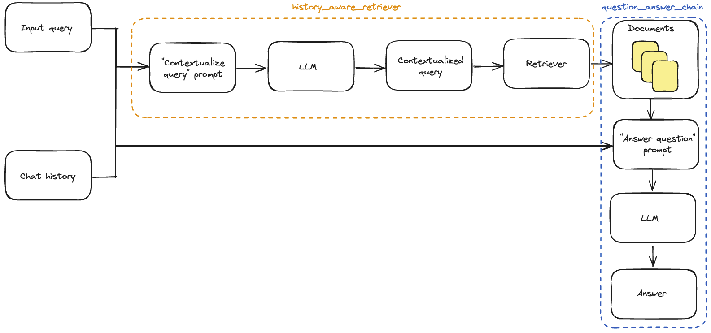
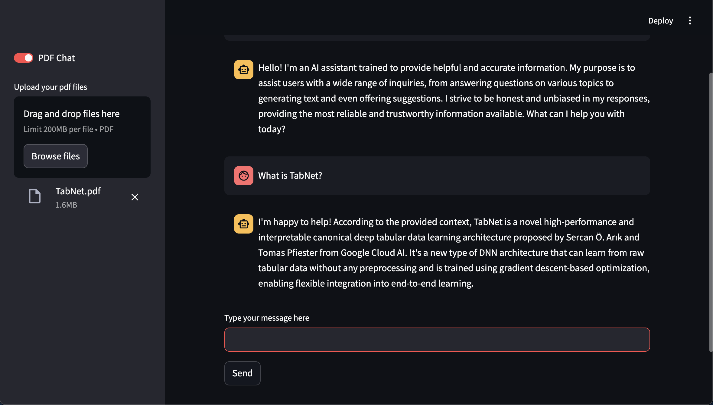
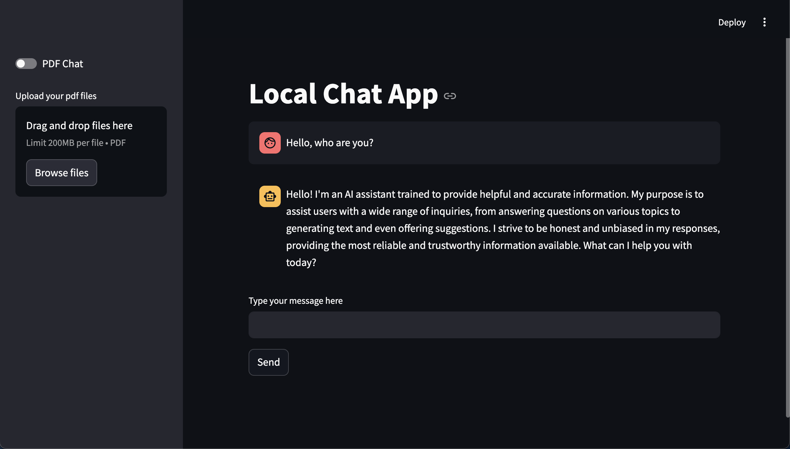

# Multimodal-RAG-Chat-App

## Introduction

Welcome to the Multimodal RAG Chatbot project! This chatbot is designed to interact with users about the data files they upload, supporting various modalities such as text, audio, and video. By leveraging Retrieval-Augmented Generation (RAG), our chatbot provides accurate and contextually relevant responses, enhancing user interaction and experience.

The primary objective of this project is to create a versatile and user-friendly chatbot capable of handling multiple data formats. Whether you need to analyze text documents, transcribe audio files, or extract information from videos, this chatbot is equipped to assist you effectively.

Key features of the Multimodal RAG Chatbot include:

* **Multimodal Support**: Interact with the chatbot using text, audio, and video files.
* **Accurate Responses**: Utilizes advanced RAG techniques to provide precise and relevant answers.

Easy Integration: Simple setup and configuration for seamless integration into your workflow.

This documentation will guide you through the setup, usage, and technical aspects of the project, ensuring you can fully leverage the capabilities of the Multimodal RAG Chatbot.

## Table of contents

## Project Organization
```tree
├── src
│   ├── vectorstore.py
│   ├── pdf_handler.py
│   ├── llama_cpp_chains.py
│   ├── ollama_chain.py
│   └── utils.py
├── app.py
└── config.yaml
```

## Getting Started

To get started with Multimodal RAG Chatbot, follow these simple steps:

**1. Clone this prject**

```bash
git clone https://github.com/Leon-Sander/local_multimodal_ai_chat.git
```

**2. Install Python environments**
```bash
# Install python virtual environment
python3.12 -m venv .venv
# Upgrade pip
pip install -U pip

# Install essential packages 
pip install -r requirements.txt
```

**3. Install Ollama**

- Install Ollama [here](https://ollama.com/download)

- After successfully installed Ollama, running it and testing by command
```bash
ollama -v
# the output should be "ollama version is <Ollama newest version>
```

- Install essential models by command
```bash
ollama pull <model name>
```

- Check if model is installed correctly by running the following command in your terminal:
```bash
ollama list
```

- If your model is installed successfully, it will appear in the output list

- Finally, you can go to `config.yaml` to configure your model. Please map the model kind with appropriate model name. For example, if you want to use `llama3:latest`, you should set `model` field in `chat_model` to `llama3:latest` in `config.yaml`.

**4. Setup Pinecone vector database**

You just need to create a Pinecone account at [here](https://www.pinecone.io/). The free tier of Pinecone is enough for our purpose.

**5. Running**

After succeeding all above steps, running **Streamlit** application by

```bash
streamlit run app.py
```

Make sure being at same directory with `app.py` file

## RAG components

**Retrieval-Augmented Generation (RAG)** is a technique designed to improve the performance of Language Learning Models (LLMs) by incorporating specific data. This method consists of two main stages:

- **Indexing Stage**: During this phase, a comprehensive knowledge repository is created and systematically structured, ensuring it is ready for future use.

- **Querying Stage**: In this phase, relevant information is retrieved from the pre-established knowledge repository, helping the LLM generate accurate and contextually appropriate responses to user queries.

### Indexing Stage:
The indexing stage involves processing the input documents and preparing them for efficient retrieval. This process can be broken down into the following steps, as illustrated in the image:

- **Document Conversion**: Convert input PDFs or HTML files into plain text.
- **Text Chunking**: Split the text into smaller, manageable chunks.
- **Embedding Generation**: Transform text chunks into vector embeddings that capture semantic meaning.
- **Vector Storage**: Store these embeddings in a vector database for efficient similarity searches.


### Querying Stage

Our RAG (Retrieval-Augmented Generation) system employs a sophisticated querying process that combines history-aware retrieval with a question-answering chain. The process can be broken down into two main components:

1. History-Aware Retriever
2. Question-Answer Chain

The whole stage can be illustated as following images



#### 1. History-Aware Retriever

The history-aware retriever enhances the query by considering both the input query and the chat history. This process involves several steps:

a) **Contextualize Query**: The input query is combined with the chat history to create a contextualized query prompt.

b) **LLM Processing**: A Language Model (LLM) processes the contextualized query prompt to understand the full context of the user's question.

c) **Contextualized Query Generation**: The LLM generates a more informed, context-aware query based on its understanding.

d) **Retrieval**: The contextualized query is used to retrieve relevant documents from the knowledge base.

#### 2. Question-Answer Chain

The question-answer chain takes the retrieved documents and generates a final answer. This process includes:

a) **Document Input**: The retrieved documents are passed into this chain.

b) **Answer Generation Prompt**: An "Answer question" prompt is created, incorporating the original input query, chat history, and retrieved documents.

c) **LLM Processing**: Another LLM processes this prompt to generate a comprehensive answer.

d) **Final Answer**: The LLM produces the final answer based on the retrieved information and the original context.

This two-stage approach allows our RAG system to provide more accurate and contextually relevant answers by considering both the current query and the ongoing conversation history.

## Frontend Service

### Frontend Application

The frontend of our RAG system is built using Streamlit, providing an intuitive and interactive user interface for interacting with the AI assistant and uploading documents.

This frontend design allows for seamless interaction with the underlying RAG system, making it easy for users to leverage AI capabilities while referencing their own documents.

Users can both use by 2 modes: *PDF chat* and *non PDF chat*

- ***PDF chat mode***: In this mode, users have to upload your documents which have to be in .pdf type. The LLM will refer the content of uploaded files to answer your questions. The system prioritize the precision of the answer most.



- ***non PDF chat mode***: In this mode, the system will answer user's question by itself knowledge which will enhance the creativity of model.



Users can easily switch between 2 modes by a top left toggle.

## Future works

1. Audio chat
2. Video chat
3. Containerize application by Docker
4. Deiverize model provider such as OpenAI, Google Gemini, etc.

## Contact Information

For any questions, please contact me at:

- Email: Buitanphuong712@gmail.com